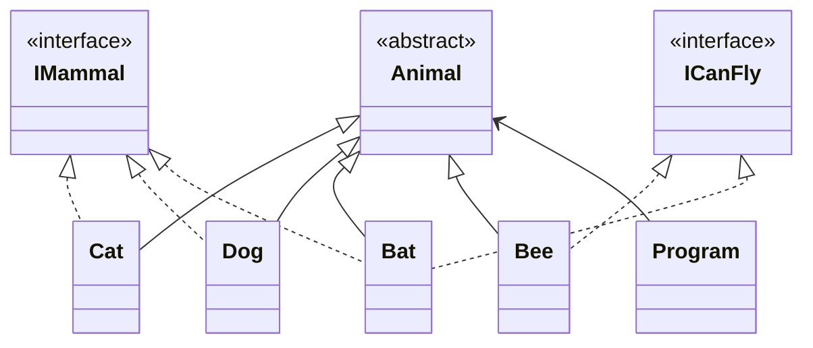

# UML Diagram : AnimalKingdom

```mermaid
classDiagram

    IMammal     <|.. Cat
    IMammal     <|.. Dog
    IMammal     <|.. Bat

    ICanFly     <|.. Bee
    ICanFly     <|.. Bat
  
    Animal      <|-- Cat
    Animal      <|-- Dog
    Animal      <|-- Bat
    Animal      <|-- Bee
    Animal      <-- Program

    class IMammal
    <<interface>> IMammal

    class ICanFly
    <<interface>> ICanFly

    class Animal
    <<abstract>> Animal
```
- Diogo Freire 22104684
#